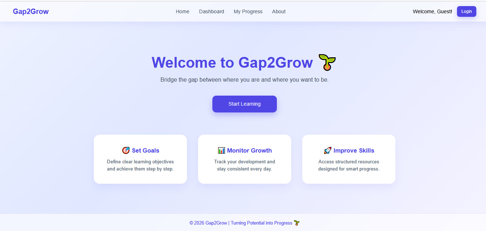
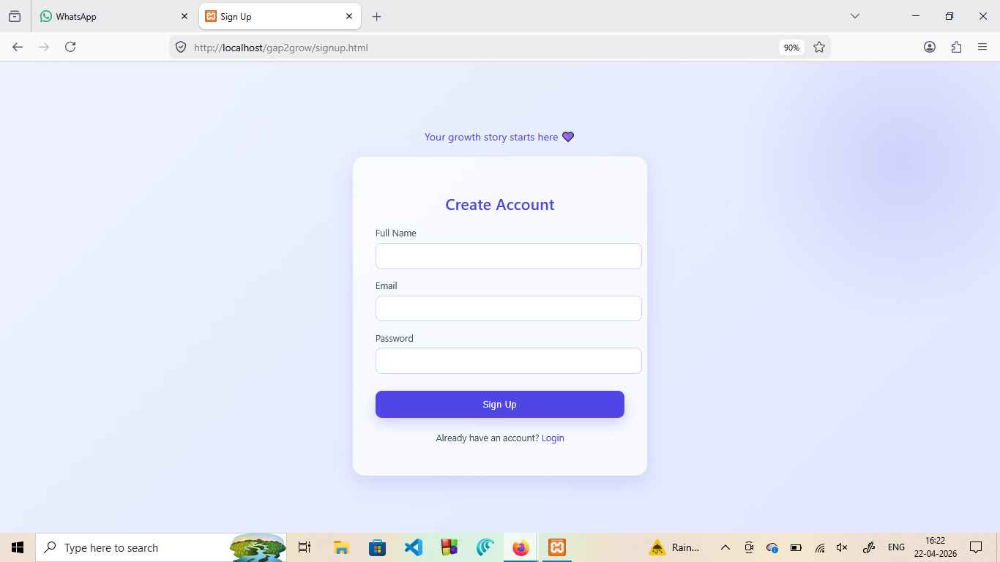
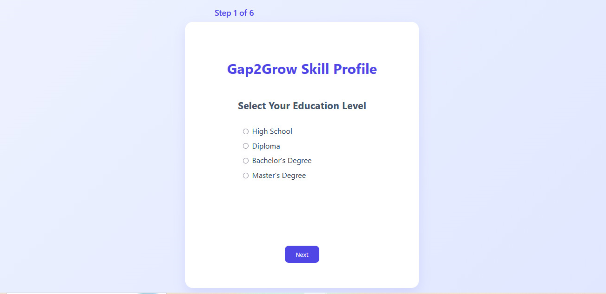
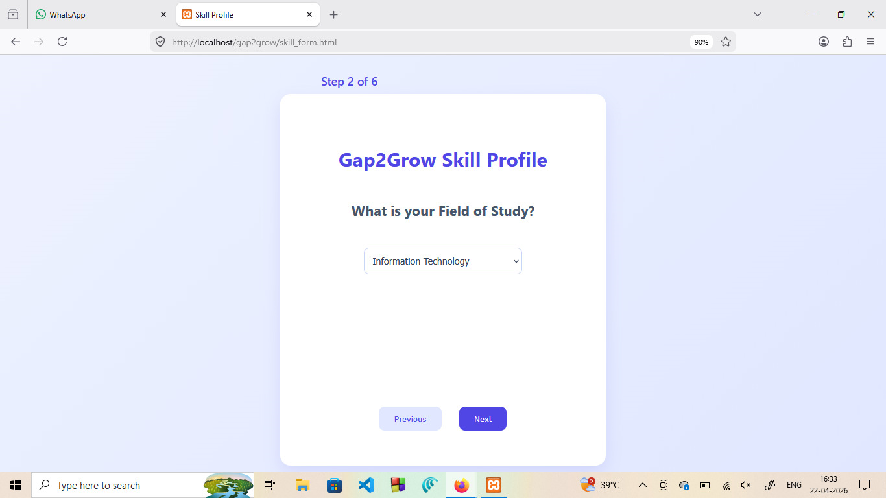
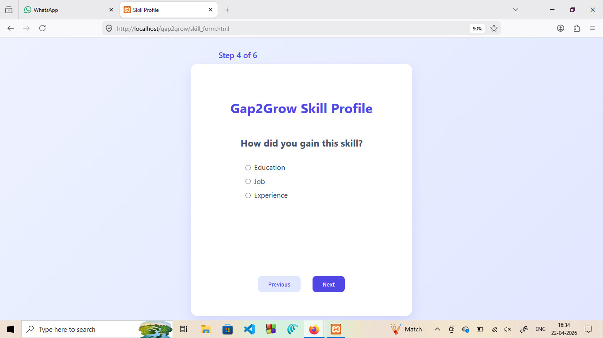
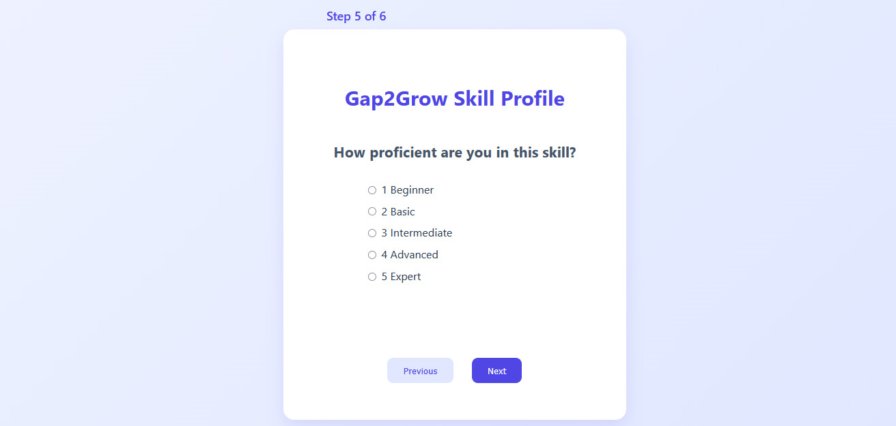
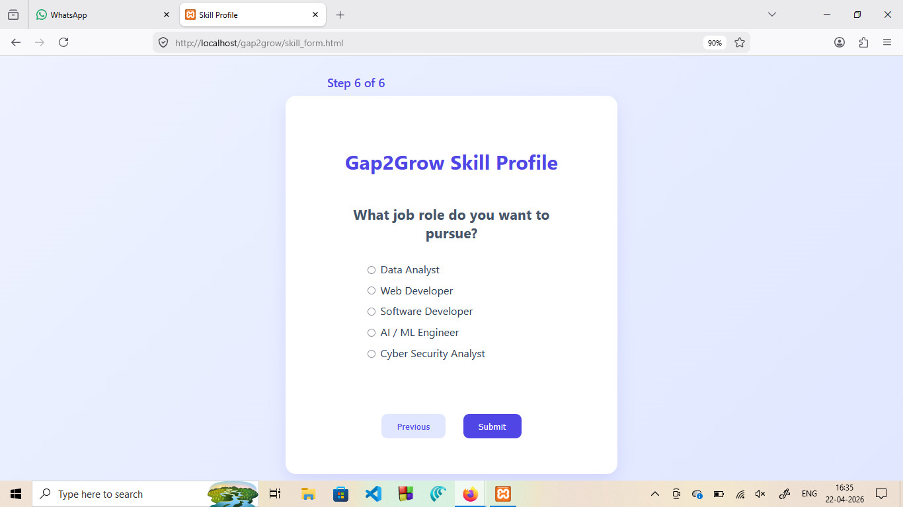
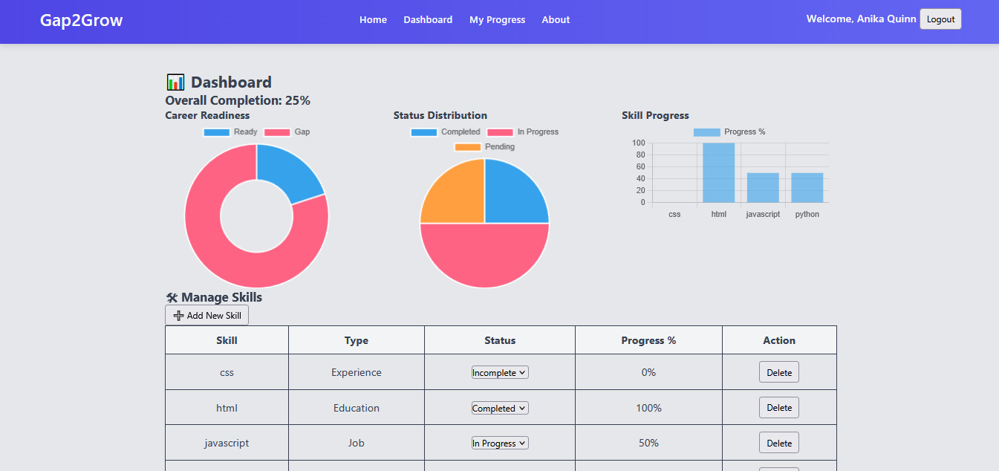
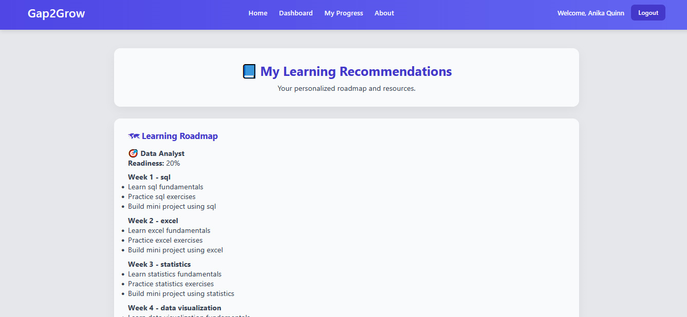
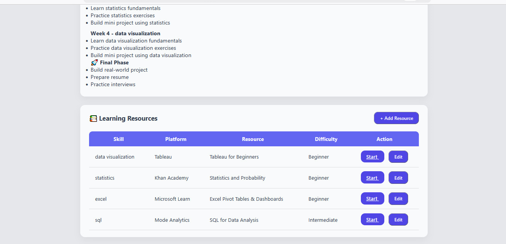

# Gap2Grow

Gap2Grow is a skill gap analysis and career development platform designed to help students identify missing skills, receive personalized learning recommendations, and track their progress toward their target career goals.

The platform compares user skills with industry-required skills and generates:
- Skill gap analysis
- Career readiness score
- Learning recommendations
- Personalized learning roadmap
- Progress tracking dashboard

---


# Website Images


## Home Page


## Signup Page



## Login Page


## Skill Profile 







## Dashboard


## Recommendation Page




---

# Features

- User Authentication System
- Skill Gap Analysis
- Career Readiness Dashboard
- Personalized Learning Recommendations
- Learning Roadmap Generation
- Skill Progress Tracking
- Add/Edit/Delete Skills
- Dynamic Recommendation Updates
- PostgreSQL Database Integration
- Python-based Recommendation Engine

---

# Tech Stack

## Frontend
- HTML5
- CSS3
- JavaScript
- Chart.js

## Backend
- PHP

## Database
- PostgreSQL

## Recommendation & Analysis Engine
- Python
- psycopg2

---

# Team Members
- Esha Gadekar 
- Siddhi Kale
- Samantha Fernandes 

---

# Installation and Setup

## 1. Clone the Repository

```bash
git clone https://github.com/your-username/gap2grow.git
cd gap2grow
```

---

# 2. Install Required Software

## Install XAMPP
Download and install XAMPP:

https://www.apachefriends.org/index.html

## Install PostgreSQL
Download and install PostgreSQL:

https://www.postgresql.org/download/

## Install Python
Download and install Python:

https://www.python.org/downloads/

---

# 3. Install Python Dependencies

Open terminal or command prompt and run:

```bash
pip install psycopg2
```

---

# 4. Setup Database

Open PostgreSQL terminal and create database:

```sql
CREATE DATABASE gap2grow;
```

Import the database file:

```bash
psql -U postgres -d gap2grow -f database.sql
```

---

# 5. Configure Database Connection

Open `db.php`

Update the database credentials:

```php
$host = "localhost";
$dbname = "gap2grow";
$user = "postgres";
$password = "your_password";
```

Also update PostgreSQL credentials inside:
- `module2.py`
- `recommendation_engine.py`
- `roadmap_engine.py`

---

# 6. Configure Python Path

Inside these files:
- `skill_profile.php`
- `rerun_analysis.php`
- `rerun_recommendation.php`

Update the Python executable path:

```php
$python = "C:\\Python314\\python.exe";
```

Replace it with your installed Python path.

Example:

```php
$python = "C:\\Python311\\python.exe";
```

---

# Running the Project

## Step 1

Move the project folder to:

```bash
C:\xampp\htdocs\
```

Example:

```bash
C:\xampp\htdocs\Gap2Grow
```

---

## Step 2

Start:
- Apache from XAMPP

---

## Step 3

Open browser and run:

```bash
http://localhost/Gap2Grow/welcome.php
```

---

# Dashboard Features

The dashboard provides:
- Career readiness visualization
- Skill completion tracking
- Status distribution charts
- Skill progress graphs
- Dynamic skill management

Charts are implemented using Chart.js.

---

# Python Modules

## module2.py
Performs skill gap analysis by comparing user skills with required job skills.

## recommendation_engine.py
Generates learning recommendations for missing skills.

## roadmap_engine.py
Creates a personalized weekly learning roadmap.

---

# Database Tables

The project uses the following main tables:
- users
- user_skills
- job_roles
- job_required_skills
- skill_gap_results
- recommendations
- learning_roadmaps
- skill_resources
- user_progress

---

## Project Status

This project is currently configured for local development.  
A production deployment version is planned as part of future improvements.
